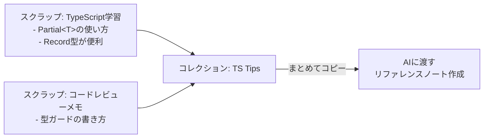
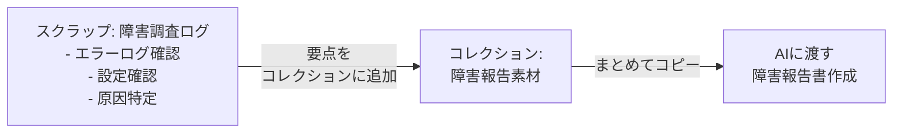
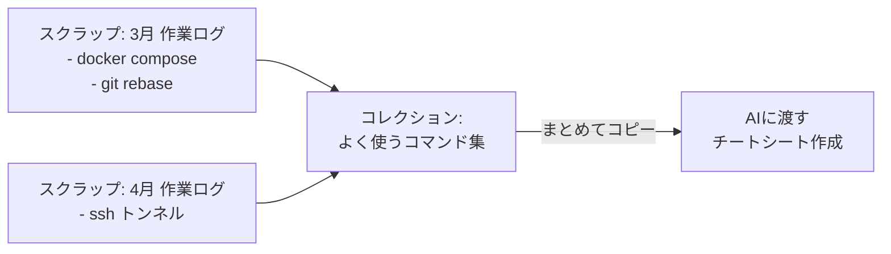

# Zen Scrap

雑に書いて、AIにつなげる。Obsidian用のスクラップメモプラグイン。

[Zenn のスクラップ機能](https://zenn.dev/scraps)をベースに、AIとの連携を意識して作った。きれいに書かなくていい。思いついたことをそのまま放り込んでおけば、あとから必要な部分だけ取り出してAIに渡せる。

AI機能そのものは入っていない。Zen Scrapはメモを溜めて整理するところまで。AIへは「まとめてコピー」でクリップボードに出すだけなので、Claude、ChatGPT、NotebookLM、何でも使える。

## コンセプト

やることは単純で、スクラップを作ってエントリを書いていくだけ。1行でいいし、体裁は気にしなくていい。それだけで時系列のメモが勝手に溜まっていく。

溜まったメモを使いたくなったら、Inboxやコレクションで拾い上げてAIに渡す。Zen Scrapの仕事はここまで。まとめたり整形したりはAIにやってもらう。

```
書き散らかす → 溜まる → 必要なものだけ集める → コピーしてAIに渡す
```

## ユースケース

### 学習メモからナレッジを作る

あちこちのスクラップに散らばった学習メモを、コレクションでひとまとめにしてAIに渡す。



### 調査ログから報告書を作る

障害対応や調査の流れをスクラップに残しておく。要点をコレクションに集めて、まとめてコピーすれば報告書の下書きをAIに頼める。



### Inboxの使いどころ

エントリに「あとで処理する」印をつける受信箱。処理したらチェックして消化する。

- 気になるエントリをInboxに入れて、あとで読み返す
- 処理が終わったらInbox一覧でチェックを入れて消化
- エントリ・スクラップ・コレクションには一切影響しない独立した仕組み

### 散らばったTipsをまとめる

月ごとの作業ログに埋もれたコマンドやTipsを、コレクションで拾い集める。



## 機能

### スクラップ

スレッド形式のメモ。エントリを時系列で積み上げていく。

- Markdownエディタ(プレビュー切替 `Cmd/Ctrl + E`、投稿 `Cmd/Ctrl + Enter`)
- 画像アップロード、外部コンテンツ埋め込み(X, YouTube, Web記事, GitHub)
- URLペースト時の自動埋め込み変換
- Obsidianリンク `[[ノート名]]` のレンダリング
- エントリのドラッグ並べ替え
- ステータス管理(Open / Closed / Archived)
- ピン留め(一覧の上部に固定)
- 放置中ラベル(設定した日数を超えたOpenスクラップに表示)
- Description欄(スクラップの説明やゴールを書いておける)

### Inbox

エントリに「あとで処理する」印をつける受信箱。

- エントリヘッダーの受信箱アイコンでInboxに追加/削除
- Inboxタブで未処理エントリの一覧を表示(バッジで件数表示)
- チェックボックスで消化(Inboxから削除、エントリ自体には影響なし)
- エントリクリックで元のスクラップに移動

### コレクション

複数のスクラップからエントリやスクラップを拾い集めて、テーマ別にまとめる。

- コレクションタブで一覧管理
- スクラップ全体またはエントリ単位で追加(検索モーダル、またはスクラップ/エントリのメニューから)
- 追加モーダルは閉じずに連続追加できる
- エントリ追加時はホバーでプレビュー表示
- アイテムのドラッグ並べ替え
- まとめてコピー(AI向けMarkdown形式)
- 元データへの参照なので、コレクションを消しても元のスクラップには影響しない

### 一覧画面

- フィルター(All / Open / Closed / Archived)
- 並び替え(作成日 / 更新日)
- 全文検索、タグフィルタリング
- 各スクラップのメニューからピン留め/アーカイブ/コレクション追加/削除

### 詳細画面

- タイトル・タグのインライン編集
- アウトライン(エントリ一覧、ホバーでプレビュー、クリックでジャンプ)
- アクションメニュー(JSONコピー、ファイルを開く、コレクションに追加、削除)
- ショートカットガイド

## インストール

1. [Releases](https://github.com/snyt45/zen-scrap/releases) から最新の `main.js`、`styles.css`、`manifest.json` をダウンロード
2. Vault の `.obsidian/plugins/zen-scrap/` フォルダを作って3ファイルを置く
3. Obsidian を再起動して、設定のコミュニティプラグインから Zen Scrap を有効化

## 設定

設定 > Zen Scrap から変更できる。

| 設定項目 | デフォルト値 | 説明 |
| --- | --- | --- |
| スクラップの保存フォルダ | `Scraps` | スクラップファイルの保存先 |
| 画像の保存フォルダ | `Scraps/images` | アップロード画像の保存先 |
| URLの自動埋め込み | ON | URLペースト時に埋め込み記法に自動変換 |
| 放置中と判定する日数 | 7 | この日数を超えたOpenスクラップにラベル表示(0で無効) |

## データの保存形式

スクラップは `Scraps/` フォルダにMarkdownファイルとして保存される。ふつうのMarkdownなので、他のエディタやツールからも読み書きできる。

```markdown
---
title: スクラップタイトル
status: open
tags: [react, frontend]
created: 2026-03-10T14:00:00.000Z
updated: 2026-03-10T14:30:00.000Z
archived: false
pinned: false
---

スクラップの説明やゴール

---

### 2026-03-10 14:00

最初のエントリ

---

### 2026-03-10 14:30

追加のエントリ

---
```

コレクションは `Scraps/collections.json` に保存される。スクラップへの参照だけを持っていて、元のファイルには手を加えない。

Inboxは `Scraps/inbox.json` に保存される。エントリへの参照(スクラップパス + タイムスタンプ)だけを持ち、元のエントリには一切影響しない。

## 埋め込み記法

```
@[tweet](https://x.com/ユーザー名/status/ツイートID)
@[youtube](https://youtu.be/動画ID)
@[card](https://example.com/記事URL)
@[github](https://github.com/owner/repo/blob/branch/path/to/file.ts#L10-L20)
```

## 開発

```bash
npm install
cp .env.example .env
```

`.env` の `OBSIDIAN_PLUGIN_DIR` を自分のVaultのプラグインディレクトリに書き換える。

```bash
npm run dev    # 開発モード(ファイル監視 + 自動コピー)
npm run build  # 本番ビルド
```
